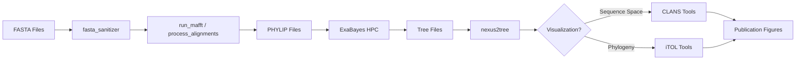

# Phylogeny Analysis Tools

A comprehensive toolkit for phylogenetic analysis workflows, from sequence alignment processing through tree construction to publication-ready visualizations.

## Table of Contents

- [Quick Start](#quick-start)
- [Finding the Right Tool](#finding-the-right-tool)
- [Typical Workflow](#typical-workflow)
- [Tool Reference](#tool-reference)
  - [Alignment Processing](#alignment-processing)
  - [Tree Processing & Analysis](#tree-processing--analysis)
  - [Visualization Tools](#visualization-tools)
  - [Utilities & Helpers](#utilities--helpers)
  - [HPC/SLURM Scripts](#hpcslurm-scripts)
- [Project Structure](#project-structure)
- [Development](#development)

---

## Quick Start

```bash
# Install dependencies
uv sync

# Most common workflow: Process alignments
uv run python src/phylogeny/process_alignments.py data/input_dir/ -r -v

# Process tree files from ExaBayes
uv run python src/phylogeny/nexus2tree.py data/trees/ -b 50

# Generate iTOL color file
uv run python src/itol/color_itol.py input.csv --id_column uid --group_column taxon
```

---

## Finding the Right Tool

| I want to...                    | Use this tool                      | Section                                       |
| ------------------------------- | ---------------------------------- | --------------------------------------------- |
| Convert FASTA/NEXUS to PHYLIP   | `process_alignments.py`            | [Alignment](#alignment-processing)            |
| Run MAFFT alignment             | `run_mafft.py`                     | [Alignment](#alignment-processing)            |
| Merge multiple FASTA files      | `merge_fasta_files.py`             | [Alignment](#alignment-processing)            |
| Remove ambiguous sequences      | `fasta_sanitizer.py`               | [Alignment](#alignment-processing)            |
| Collapse low-support tree nodes | `nexus2tree.py`                    | [Tree Processing](#tree-processing--analysis) |
| Monitor ExaBayes jobs           | `display_summary_exabayes_info.py` | [Tree Processing](#tree-processing--analysis) |
| Download ExaBayes results       | `download_exabayes_consensus.sh`   | [HPC](#hpcslurm-scripts)                      |
| Color CLANS by taxonomy         | `clans_color_groups.py`            | [Visualization](#visualization-tools)         |
| Generate iTOL colors            | `color_itol.py`                    | [Visualization](#visualization-tools)         |
| Parse SignalP6 output           | `parse_signalp6.py`                | [Utilities](#utilities--helpers)              |
| Filter sequences by domain      | `json2fasta_domain_filter.py`      | [Utilities](#utilities--helpers)              |

---

## Typical Workflow



---

## Tool Reference

### Alignment Processing

#### `process_alignments.py` - Unified Alignment Processor

**Location:** `src/phylogeny/process_alignments.py`

The main tool for processing alignment files. Handles FASTA and NEXUS formats, removes duplicates, and converts to PHYLIP format for phylogenetic analysis tools like ExaBayes.

**Features:**

- Supports FASTA (`.fasta`, `.fa`, `.fas`) and NEXUS (`.nexus`, `.nex`) formats
- Automatic duplicate sequence removal
- Sanitizes sequence names (removes special characters)
- Maintains directory structure or flattens output
- Can split output by sequence type (DNA/protein)
- Generates detailed processing logs
- Recursive directory processing

**Usage:**

```bash
# Basic usage - process directory
uv run python src/phylogeny/process_alignments.py input_dir/

# Process recursively with verbose output
uv run python src/phylogeny/process_alignments.py input_dir/ -r -v

# Split output by DNA/protein
uv run python src/phylogeny/process_alignments.py input_dir/ -s

# Custom output directory
uv run python src/phylogeny/process_alignments.py input_dir/ -o custom_output/

# Keep duplicates (no removal)
uv run python src/phylogeny/process_alignments.py input_dir/ --keep-duplicates

# Flatten directory structure
uv run python src/phylogeny/process_alignments.py input_dir/ --flat
```

**Options:**

- `-o, --output-dir`: Specify output directory (default: `input_dir/../processed`)
- `-r, --recursive`: Process subdirectories recursively
- `-s, --split-by-type`: Split output into `dna/` and `protein/` subdirectories
- `--flat`: Don't maintain directory structure
- `--keep-duplicates`: Don't remove duplicate sequences
- `--no-align-names`: Don't pad sequence names
- `-v, --verbose`: Enable verbose output

---

#### `run_mafft.py`

**Location:** `src/phylogeny/run_mafft.py`

Runs MAFFT alignment and converts output to PHYLIP format.

```bash
uv run python src/phylogeny/run_mafft.py -i input.fasta -o output.phy -a local
```

---

#### `merge_fasta_files.py`

**Location:** `src/phylogeny/merge_fasta_files.py`

Merges multiple FASTA files and removes duplicate sequences.

```bash
uv run python src/phylogeny/merge_fasta_files.py file1.fasta file2.fasta -o merged.fasta
```

---

#### `fasta_sanitizer.py`

**Location:** `src/phylogeny/exabayes/fasta_sanitizer.py`

Cleans FASTA files by removing sequences with ambiguous residues (e.g., X, B, Z in proteins).

```bash
uv run python src/phylogeny/exabayes/fasta_sanitizer.py -f input.fasta -v
```

---

#### `nexus2fasta.py`

**Location:** `src/phylogeny/nexus2fasta.py`

Converts NEXUS files to FASTA format, removing gaps.

```bash
uv run python src/phylogeny/nexus2fasta.py input.nexus
```

---

### Tree Processing & Analysis

#### `nexus2tree.py` - Tree File Processor

**Location:** `src/phylogeny/nexus2tree.py`

Processes NEXUS tree files from ExaBayes output by collapsing nodes below a bootstrap support threshold.

**Features:**

- Collapse nodes below bootstrap threshold (default 50%)
- Process single file or entire directory
- Remove leaf annotations
- Optional tree rerooting

**Usage:**

```bash
# Process single file (output: file_pruned.nexus)
uv run python src/phylogeny/nexus2tree.py file.nexus -b 50

# Process entire directory (output: input_dir_processed/*.nexus)
uv run python src/phylogeny/nexus2tree.py data/animal_venom/cap_251215/nexus/ -b 50

# Custom output directory
uv run python src/phylogeny/nexus2tree.py input_dir/ -o custom_output/ -b 50
```

**Options:**

- `-b, --bootstrap`: Bootstrap threshold for collapsing nodes (0-100, default: 50)
- `-o, --output`: Output directory (default: `input_dir_processed/`)
- `-r, --reroot`: Taxon label to use as outgroup for rerooting

---

#### ExaBayes Utilities

##### `display_summary_exabayes_info.py`

**Location:** `src/phylogeny/exabayes/display_summary_exabayes_info.py`

Monitor and summarize ExaBayes run progress and convergence metrics.

```bash
uv run python src/phylogeny/exabayes/display_summary_exabayes_info.py exabayes/run_dir/
```

**Features:**

- Parse ExaBayes info files
- Display generation progress
- Show convergence statistics (ASDSF, MSDSF)
- Calculate runtime and completion status
- Summarize multiple runs in a directory

---

##### `parse_exabayes_info.py`

**Location:** `src/phylogeny/exabayes/parse_exabayes_info.py`

Parse individual ExaBayes info files for detailed analysis.

---

##### `exabayes_gcc11_patcher.py`

**Location:** `src/phylogeny/exabayes/exabayes_gcc11_patcher.py`

Patches ExaBayes source code for GCC 11+ compatibility by resolving `byte` type conflicts.

```bash
# Run in ExaBayes source directory
python src/phylogeny/exabayes/exabayes_gcc11_patcher.py
```

---

### Visualization Tools

#### CLANS Tools

CLANS (CLuster ANalysis of Sequences) is a tool for visualizing protein sequence similarity networks in 2D/3D space.

##### `clans_color_groups.py`

**Location:** `src/clans/clans_color_groups.py`

Color CLANS visualization files by taxonomic or protein group membership.

```bash
uv run python src/clans/clans_color_groups.py input.clans groups.csv -o colored.clans
```

**Input CSV format:**

- `identifier`: Sequence ID matching CLANS file
- `Taxon_grouping`: Group name for coloring

**Features:**

- Automatic distinct color generation
- Hue-sorted color palette
- Preserves CLANS file structure

---

##### `clans_parser.py`

**Location:** `src/clans/clans_parser.py`

Parse CLANS files and extract coordinates, groups, and metadata. Includes clustering quality metrics.

```bash
uv run python src/clans/clans_parser.py input.clans -v
```

**Features:**

- Extract sequence headers and 2D/3D coordinates
- Calculate clustering metrics (Silhouette, Calinski-Harabasz, Davies-Bouldin scores)
- Export data to pandas DataFrames

---

##### `run_clans.sh`

**Location:** `src/clans/run_clans.sh`

Batch execution wrapper for running CLANS with different p-value thresholds.

```bash
# Edit script to set input file and parameters, then:
bash src/clans/run_clans.sh
```

---

#### iTOL Tools

iTOL (Interactive Tree Of Life) is a web-based tool for phylogenetic tree visualization.

##### `color_itol.py`

**Location:** `src/itol/color_itol.py`

Generate iTOL color annotation files from CSV data.

```bash
# Auto-generate colors
uv run python src/itol/color_itol.py input.csv --id_column uid --group_column taxon

# Use custom color mapping (JSON file)
uv run python src/itol/color_itol.py input.csv --id_column uid --group_column taxon \
  --color_file colors.json
```

**Input:**

- CSV with sequence IDs and grouping column
- Optional JSON file with custom color mappings: `{"group_name": "#HEX_COLOR"}`

**Output:**

- iTOL-compatible annotation file for coloring tree leaves

**Features:**

- Automatic distinct color generation
- Custom color schemes via JSON
- Hue-sorted color palettes
- Handles missing groups gracefully

---

### Utilities & Helpers

#### `parse_signalp6.py`

**Location:** `src/phylogeny/parse_signalp6.py`

Process FASTA sequences based on SignalP6 predictions. Interactively decide whether to cut signal peptides, keep sequences intact, or remove them.

```bash
uv run python src/phylogeny/parse_signalp6.py \
  --fasta_input input.fasta \
  --signalp_output signalp6_output.gff3 \
  --fasta_output processed.fasta \
  --user_decisions decisions.json
```

**Features:**

- Interactive sequence-by-sequence decisions
- Save/load decision history for reproducibility
- Automated processing for previously seen sequences

---

#### `json2fasta_domain_filter.py`

**Location:** `src/phylogeny/exabayes/json2fasta_domain_filter.py`

Extract sequences from JSON files filtered by specific protein domains.

```bash
# Extract specific domain
uv run python src/phylogeny/exabayes/json2fasta_domain_filter.py \
  -j proteins.json -o output.fasta -d "SVMP" -v

# Extract all non-fragment sequences
uv run python src/phylogeny/exabayes/json2fasta_domain_filter.py \
  -j proteins.json -o output.fasta -v
```

---

#### `protein_name_mapping.py`

**Location:** `src/prot_family/protein_name_mapping.py`

Standardize protein names using regular expression patterns. Contains mapping function for DPP (dipeptidyl peptidase) family proteins.

```python
from src.prot_family.protein_name_mapping import dpp_protein_mapping

standardized_name = dpp_protein_mapping("putative dipeptidyl peptidase 4")
# Returns: "DPP4"
```

---

#### `helper.py`

**Location:** `src/helper.py`

DataFrame manipulation utilities.

```python
from src.helper import add_column_before

# Add a column from df1 to df2 before a target column
merged_df = add_column_before(df1, df2, "new_col", "target_col", "uid")
```

---

### HPC/SLURM Scripts

**Location:** `docs/`

#### `exabayes_array.slurm`

SLURM array job script for running ExaBayes on multiple alignment files in parallel.

**Features:**

- Processes multiple PHYLIP files as array jobs
- Configurable run parameters (generations, chains, convergence)
- Automatic output directory creation
- Skips already-processed files

**Usage:**

```bash
# Edit paths and parameters in script, then:
sbatch docs/exabayes_array.slurm
```

---

#### `consense_array.slurm`

SLURM array job script for generating consensus trees from ExaBayes output.

**Usage:**

```bash
sbatch docs/consense_array.slurm
```

---

#### `download_exabayes_consensus.sh`

**Location:** `scripts/download_exabayes_consensus.sh`

Download and rename ExaBayes consensus tree files from remote HPC to local machine.

```bash
# Download from remote server
bash scripts/download_exabayes_consensus.sh \
  /remote/path/to/exabayes/output \
  data/local_output_dir/nexus
```

**Features:**

- Automatic file filtering (downloads only consensus trees)
- Renames files for clarity
- Progress tracking with rsync
- Bandwidth limiting option

---

## Project Structure

```
phylogeny/
├── src/
│   ├── phylogeny/           # Main phylogenetic analysis tools
│   │   ├── process_alignments.py
│   │   ├── nexus2fasta.py
│   │   ├── nexus2tree.py
│   │   ├── run_mafft.py
│   │   ├── merge_fasta_files.py
│   │   ├── parse_signalp6.py
│   │   └── exabayes/
│   │       ├── fasta_sanitizer.py
│   │       ├── display_summary_exabayes_info.py
│   │       ├── parse_exabayes_info.py
│   │       ├── exabayes_gcc11_patcher.py
│   │       └── json2fasta_domain_filter.py
│   ├── clans/               # CLANS visualization tools
│   │   ├── clans_color_groups.py
│   │   ├── clans_parser.py
│   │   └── run_clans.sh
│   ├── itol/                # iTOL visualization tools
│   │   └── color_itol.py
│   ├── prot_family/         # Protein family analysis
│   │   └── protein_name_mapping.py
│   └── helper.py            # General utilities
├── scripts/
│   └── download_exabayes_consensus.sh
├── docs/                    # HPC/SLURM job scripts
│   ├── exabayes_array.slurm
│   ├── consense_array.slurm
│   └── configFile-all-options.nex
├── notebook/                # Exploratory/development notebooks
│   ├── finalize_trees.ipynb
│   ├── process_nexus.ipynb
│   └── extract_partition_and_phy.ipynb
├── data/                    # Data directories (not in git)
├── tests/                   # Unit tests
└── out/                     # Output files (not in git)
```

**Note on Notebooks:**

- Notebooks in `notebook/` are for exploratory analysis and development
- Production scripts in `src/` supersede notebook implementations
- `finalize_trees.ipynb` contains tree manipulation prototypes → use `nexus2tree.py` for production

---

## Workflow Examples

### Example 1: Process venom protein alignments

```bash
# Process all FASTA files recursively, split by type
uv run python src/phylogeny/process_alignments.py \
  data/animal_venom/cap_251215/raw \
  -o data/animal_venom/cap_251215/processed \
  -r -s -v
```

Output structure:

```
processed/
├── dna/
│   └── [subdirs with .phy files]
├── protein/
│   └── [subdirs with .phy files]
└── processing_log.txt
```

---

### Example 2: Complete phylogenetic workflow

```bash
# 1. Clean sequences
uv run python src/phylogeny/exabayes/fasta_sanitizer.py -f input.fasta -v

# 2. Align with MAFFT
uv run python src/phylogeny/run_mafft.py -i input_clean.fasta -o aligned.phy -a local

# 3. Run ExaBayes (on HPC)
sbatch docs/exabayes_array.slurm

# 4. Generate consensus trees (on HPC)
sbatch docs/consense_array.slurm

# 5. Download results
bash scripts/download_exabayes_consensus.sh \
  /remote/path/exabayes data/local/nexus

# 6. Process trees (collapse low support nodes)
uv run python src/phylogeny/nexus2tree.py data/local/nexus/ -b 50

# 7. Generate iTOL colors for visualization
uv run python src/itol/color_itol.py metadata.csv \
  --id_column uid --group_column taxon
```

---

### Example 3: CLANS visualization workflow

```bash
# 1. Prepare sequence data
# (Run all-vs-all BLAST and format for CLANS)

# 2. Run CLANS with different p-value thresholds
bash src/clans/run_clans.sh

# 3. Color by taxonomic groups
uv run python src/clans/clans_color_groups.py \
  out/clans/100k_50.clans \
  metadata.csv \
  -o out/clans/100k_50_colored.clans

# 4. Analyze clustering quality
uv run python src/clans/clans_parser.py \
  out/clans/100k_50_colored.clans -v
```

---

## Development

### Installation

This project uses `uv` for dependency management:

```bash
# Install dependencies
uv sync

# Install with dev tools
uv sync --extra dev
```

### Testing

```bash
# Run all tests
uv run pytest tests/

# Run specific test file
uv run pytest tests/test_helper.py -v
```

### Code Quality

```bash
# Format code
uv run ruff format src/

# Lint code
uv run ruff check src/
```

### Contributing

When adding new tools:

1. Follow the existing code structure in `src/`
2. Add comprehensive docstrings with usage examples
3. Include the tool in this README under the appropriate category
4. Add unit tests where applicable (`tests/`)
5. Update the "Finding the Right Tool" table if it's a commonly-used feature

---

## Recent Updates

### 2025-01-09

- ✅ Restructured README for better navigation
- ✅ Documented all tool categories (CLANS, iTOL, ExaBayes utilities)
- ✅ Added workflow diagrams and quick reference table
- ✅ Removed duplicate backup scripts
- ✅ Added comprehensive usage examples

### 2024-12-15

- ✅ Created unified `process_alignments.py` script
- ✅ Removed redundant scripts (replaced by `process_alignments.py`)
- ✅ Improved logging and error handling
- ✅ Added comprehensive command-line options

---

## License

[Add your license information here]
